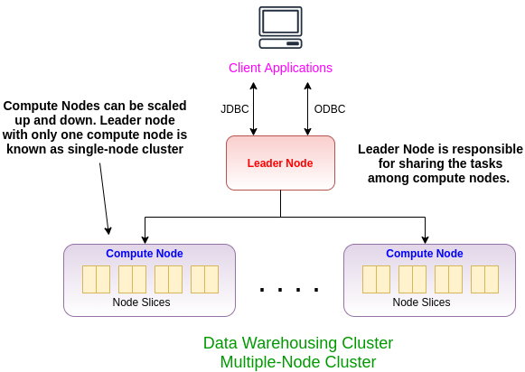

# Amazon Redshift

## How to get started:

step 1: create an IAM role

In general, for any operation that one AWS resource needs access to another AWS resource, you need to defined a separate IAM role. For this project, you need to give AWS redshift permission to access S3 and load data from there. 

You can create the role directly from the AWS console. In IAM console, create a role for Redshift service (use case: Redshift-Customizable) and attach a permission policy for read-only access to S3 (AmazonS3ReadOnlyAccess). 

You can also, ask terraform to create an IAM role for you. You can find an example of it in ```iamrole.tf``` file in the terraform folder.

step 2: configure Redshift

determine the following parameters:
 - cluster_identifier = "tf-redshift-cluster"
 - database_name      = "newvisionredshift"
 - master_username    = "??????"
 - master_password    = "???????????"
 - node_type          = "dc1.large"
 - cluster_type       = "single-node"
 - port               = 5439
 - cluster_subnet_group_name = aws_redshift_subnet_group.redshift-subnet.name
 - vpc_security_group_ids = [aws_security_group.allow-redshift.id]
 - skip_final_snapshot = true
 - publicly_accessible = true
 - iam_roles = [aws_iam_role.redshift_role.arn]

step 3: Connect to the sample cluster and run queries

To query databases hosted by your Amazon Redshift cluster, you have two options:
 - Connect to your cluster and run queries on the AWS Management Console with the query editor. If you use the query editor, you don't have to download and set up an SQL client application.
 - Connect to your cluster through an SQL client tool, such as SQL Workbench/J.


Below, you can see the Amazon Redshift Architecture. 



### Source:\
- Getting started with Amazon Redshift [link](https://docs.aws.amazon.com/redshift/latest/gsg/getting-started.html)

