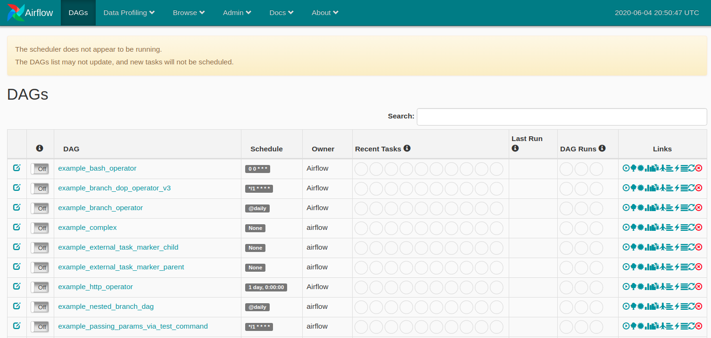

# How do I start?

Airflow needs a home, ~/airflow is the default\
```export AIRFLOW_HOME=~/airflow```

Install from pypi using pip\
```pip install apache-airflow```

Installation checkpoint\
```airflow version```

Initialize the database\
```airflow initdb```

Start the web server, default port is 8080, change if there is conflict\
```airflow webserver -p 9000```

Go to the webserver on your browser\
if it is hosted locally then www.localhost:9000\
if it is hosted on a remote server, then www.<ip_address>:9000

The Airflow UI console is similar to below picture




