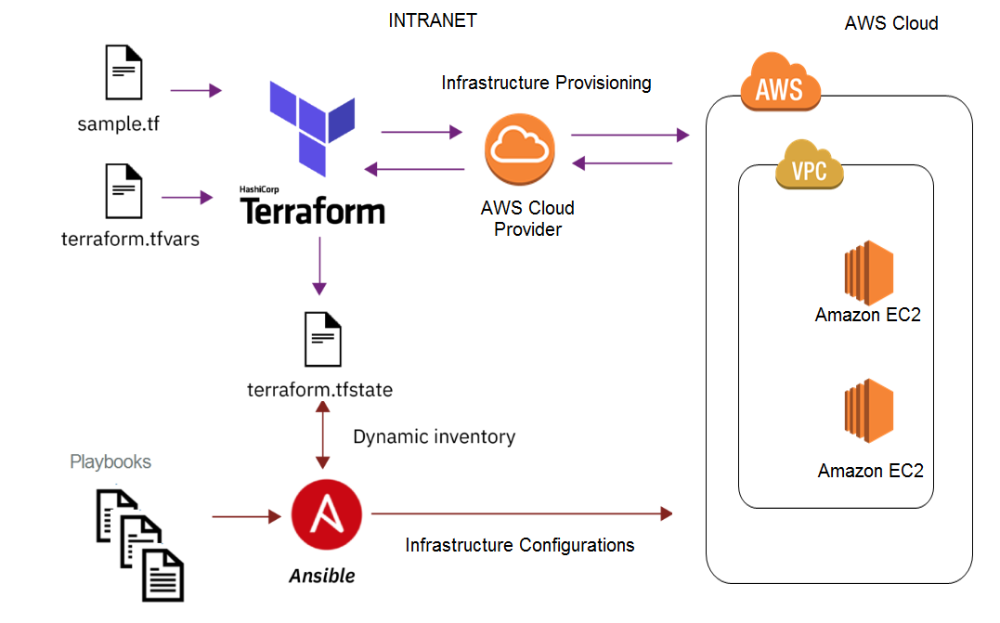

# How to use Ansible with Terraform

Terraform is excellent at provisioning the infrastructure. However, it is mediocre in configuration management. On the other hand, Ansible is a great tool for configuration management. So, it is better to combine the strength of these tools. Use Terraform to provision your infra, and when they are in place, use Ansible for software installation and configuration on your infrastructure. Overall, these two together can provide an awesome integrated end to end automation solution.

The key is to use Terraform```provisioners```. Here I use two provisioners, ```local-exec``` and ```remote-exec```. 

I use ```remote-exec``` to install Python on the remote target machines. Ansible needs Python to run and because of that it is necessary to install Python on remote host first. 

Then the next step is to use ```local-exec``` to run Ansible locally on my machine. Basically, my local machine is the controller node, so the Ansible should run on my machine and push the configuration I defined on my desired playbook to remote hosts. 

In ```local-exec``` provisioner, I give the provisioner the IP address of the remote computer; So, it can be used by Ansible to SSH into that node and push the configuration I defined in the playbook file. 


The diagram below depicts a scenario where it uses Terraform to provision the infrastructure and Ansible for configuration management all on AWS Cloud.




 


### Reference:

- Building Repeatable Infrastructure with Terraform and Ansible on AWS [link](https://medium.com/faun/building-repeatable-infrastructure-with-terraform-and-ansible-on-aws-3f082cd398ad)


