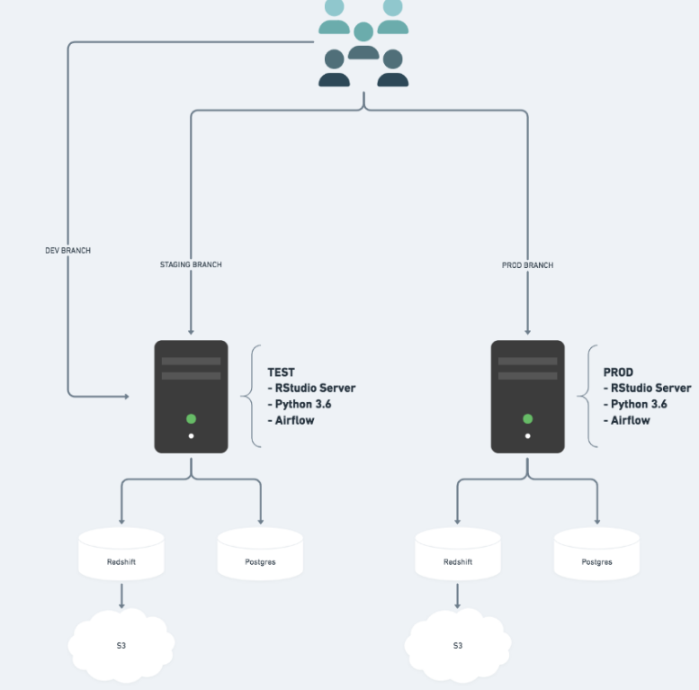
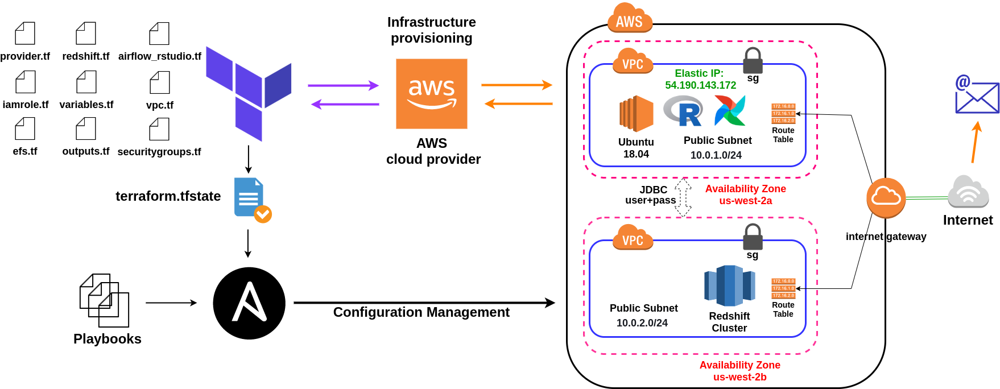

# New Vision CI/CD Pipeline

This is the Github repo for my project at Insight datascience. I was a DevOps fellow and the project was a pro bono consulting project for a NY-based education company.

The existing infrastructure of the company is presented below. There are two AWS EC2 instances that host staging and production environments. I was presented with two challenges:
- One, the developers push their codes directly to the staging environment. How can we create an infrastructure that performs integration testing first before allowing the code to merge with the master branch? 
- Two, the data pipelines use static schemas and the schema is embedded to the existing source code, so any change to the database schemas breaks the existing code, how can we solve this problem?

  

After studying the existing architecture and problem statements carefully, I came up with the below solutions for these two problems.
- For the first problem, the solution is to integrate a continuous integration (CI) tool with the Github and configure it to perform unit testing before the merge. Since I was told the company has some familiarity with CircleCI, I decided to use CircleCI as my CI tool. BTW, Github, itself, has a native CI tool, i.e. Github Action, which could have been used.
- For the second problem, there are multiple approaches, for example, one way is to migrate to dynamic schemas and use ORM tool that works with R. This way, the source code is free from database schemas and your developers don't need to memorize the schemas. However, it requires a complete overhaul of exisiting source codes. The other solution, is to create a temporary replica of the production environment and test the new source code or database changes. I decided to go with the second solution. 

## One-Click Ephemeral Test Environment

As I mentioned earlier, in order to solve the second challenge, I decided to replicate the production environment and submit new code/database changes to this temporary infrastructure to understand its reaction. If the new changes are compatible with my existing workflows, then I would receive an email notifying me that everything has run successfully and nothing is broken during the test. 

The architecture for this shadow ephemeral test environment is shown below: 

  

<!--  -->
