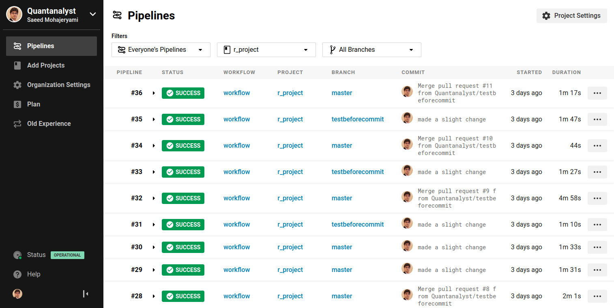

This is the folder that contains files that I used to demo how to use CircleCI as a CI tool. 

In order to integrate the CircleCI to your Github, you must create an account on CircleCI website with your Github account. Then, you add your desired repo to your CircleCI projects. 

Below, you can see my CircleCI account and the integration testing result of my pushes to my Github. 

  

References: 
Continuous integration for your private R projects with CircleCI (link = https://appsilon.com/continuous-integration-for-your-private-r-projects-with-circleci/)
