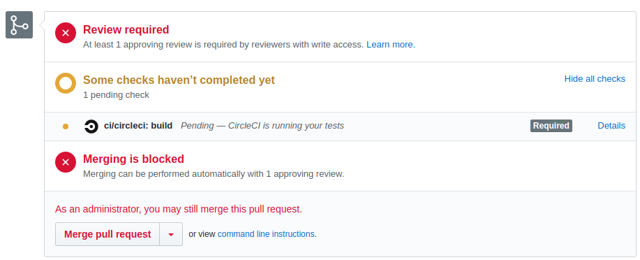
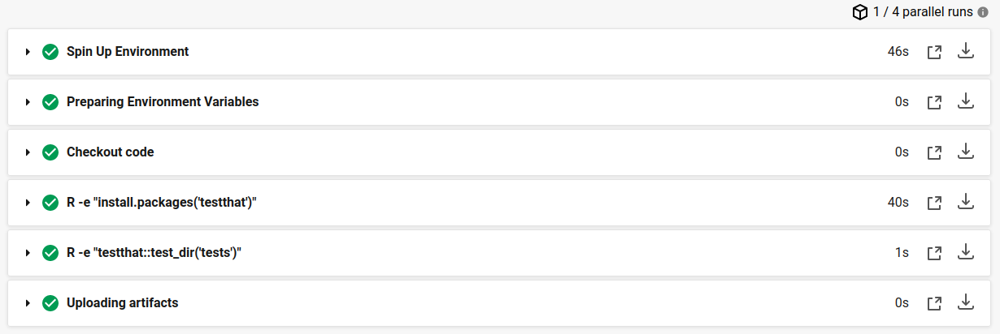

This is the folder that contains files that I used to demo how to use CircleCI as a CI tool. These are just the files, the repo itself is located [here](github.com/Quantanalyst/r_project)

In order to integrate the CircleCI to your Github, you must create an account on CircleCI website with your Github account. The next step is to connect your desired repo to CircleCI projects and make some setting changes in your Github account. 

In the Github repo settings, you have this option to protect your desired branch. In other words, you tell Github that you only allow certain changes. For example, you can set your repo in a way that after each pull request, CircleCI performs the unit tests and when the results ready, then under some conditions, the pull request is allowed to merge with your protected branch. 

As you can see, on this directory, I have a folder named ```.circleci```, this folder has a YAML file that gives the CircleCI instructions about what to do and where to look for unit testing. 

The other folder is ```tests``` that contains your unit tests. For every unit in your source, you must have a test counterpart in this folder. For example, my code name is ```my_code.R```, so, I must have a unit test named ```test_my_code.R``` in the folder. For unit testing in R, I used ```testthat``` package. 

Here is how to start after everything is configured. You should push your code changes to  a test branch, it automatically triggers CircleCI to perform unit test. When you ask for a pull request, it looks into the CircleCI results, if they are successful, then under certain conditions, Github allows you to merge the test branch with the protected branch (e.g. master). Below, you can see when Github is waiting for CircleCI to run all the tests. 

<p align="center">  </p>

Another picture showing the tests run by CircleCI.

<p align="center">  </p>

Finally, take a look at my CircleCI account and the integration testing result of my pushes to Github. 

<p align="center">  </p>