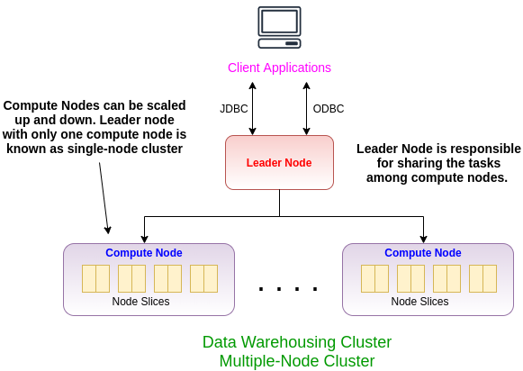

# Amazon Redshift

Amazon Redshift is the data warehousing resource I used in this project to store my dummy database. Terraform has this resource, so, you only need to configure it. Below, I put the items that I have configured for my Redshift. 

Determine the following parameters:
 - cluster_identifier = "tf-redshift-cluster"
 - database_name      = "newvisionredshift"
 - master_username    = "??????"
 - master_password    = "???????????"
 - node_type          = "dc1.large"
 - cluster_type       = "single-node"
 - port               = 5439
 - cluster_subnet_group_name = aws_redshift_subnet_group.redshift-subnet.name
 - vpc_security_group_ids = [aws_security_group.allow-redshift.id]
 - skip_final_snapshot = true
 - publicly_accessible = true
 - iam_roles = [aws_iam_role.redshift_role.arn]

If you are not sure exactly what type of Redshift you want, you can go to Redshift console and create a dummy Redshift to see what is available and use that setting in your configuration. 

Some settings are common for all terraform resources. You should determine the VPC, the subnet inside the vpc and security group. 

Another import thing is IAM role. In general, for any operation that one AWS resource needs access to another AWS resource, you need to define a separate IAM role. For this project, I gave AWS redshift permission to access S3 and load data from there.

If you are interested in architecture of Redshift clusters. Below is a picture of a typical Redshift cluster. 

If you want to learn more about Redshift, one good resource is Amazon itself, below is the reference I used to configure my Redshift. 
- Getting started with Amazon Redshift [link](https://docs.aws.amazon.com/redshift/latest/gsg/getting-started.html)

