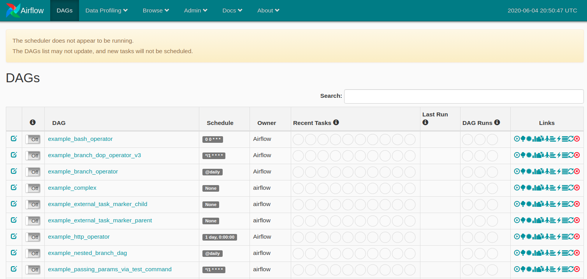

# How do I start?

Airflow is a very powerful tools and there is a large community of developers contributing to its development. It has many plugins and operators that make it to work with any resources in the market. Here I just put some notes for quick reference, at the end, I mention a Udemy course that very elegantly teaches import thing about the tool. 

Airflow needs a home, ~/airflow is the default\
```export AIRFLOW_HOME=~/airflow```

Install from pypi using pip\
```pip install apache-airflow```

Installation checkpoint\
```airflow version```

Initialize the database\
```airflow initdb```

Start the web server, default port is 8080, change if there is conflict\
```airflow webserver -p 9000```

Go to the webserver on your browser\
if it is hosted locally then ```www.localhost:9000``` \
if it is hosted on a remote server, then ```www.<ip_address>:9000```

The Airflow UI console is shown below:



### Reference
- Apache Airflow: The Hands-On Guide [Link](https://www.udemy.com/course/the-ultimate-hands-on-course-to-master-apache-airflow/)